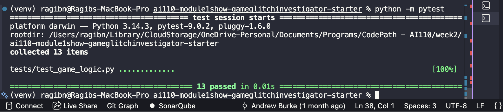
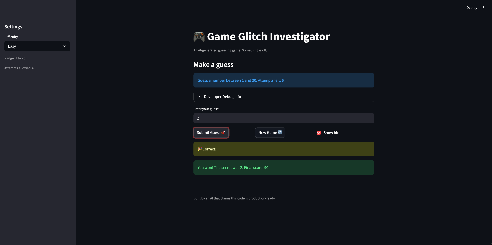

# 🎮 Game Glitch Investigator: The Impossible Guesser

## 🚨 The Situation

You asked an AI to build a simple "Number Guessing Game" using Streamlit.
It wrote the code, ran away, and now the game is unplayable. 

- You can't win.
- The hints lie to you.
- The secret number seems to have commitment issues.

## 🛠️ Setup

1. Install dependencies: `pip install -r requirements.txt`
2. Run the broken app: `python -m streamlit run app.py`

## 🕵️‍♂️ Your Mission

1. **Play the game.** Open the "Developer Debug Info" tab in the app to see the secret number. Try to win.
2. **Find the State Bug.** Why does the secret number change every time you click "Submit"? Ask ChatGPT: *"How do I keep a variable from resetting in Streamlit when I click a button?"*
3. **Fix the Logic.** The hints ("Higher/Lower") are wrong. Fix them.
4. **Refactor & Test.** - Move the logic into `logic_utils.py`.
   - Run `pytest` in your terminal.
   - Keep fixing until all tests pass!
   - 

## 📝 Document Your Experience

- [ ] Describe the game's purpose.
      - The purpose of this game is to guess a "secret" number given a range from a to b. The difficulty varies from easy to normal to hard, with more difficult levels increasing the range of numbers. Players start off with an intial number of attempts and the hard mode gives the least number of attempts. Each attempt, the player either guesses the number correctly and wins or he is given hints. These hints reveal whether the secret number is higher or lower than their current guess. 
- [ ] Detail which bugs you found.
      - There were many bug in this app. One of the major bugs was the secret number generation. Each interaction from the user reset the secret values, making the hints useless. Another issue was the failure to validate inputs. Hence, I was able to put values like -1 and 101, which are out of bounds even for the hard mode. There was another inconsistency with the allowed attempts for each level, which is unexpected behavior. 
- [ ] Explain what fixes you applied.
      - The first issue I mentioned regarding the secret number generation was due to the reruns from Streamlit which reset any state variables established. A simple fix to this was storing that random values inside of a state_session which preserved it in memory, making hints helpful. For the second bug I described, the fix was implemented in the parse_guess() function, validating numeric inputs and prevention out of bounds errors. For the allowed attempts on each level, i simply used a dictionary to map the values to each difficulty. 

## 📸 Demo

- [ ] 

## 🚀 Stretch Features

- [ ] [If you choose to complete Challenge 4, insert a screenshot of your Enhanced Game UI here]
